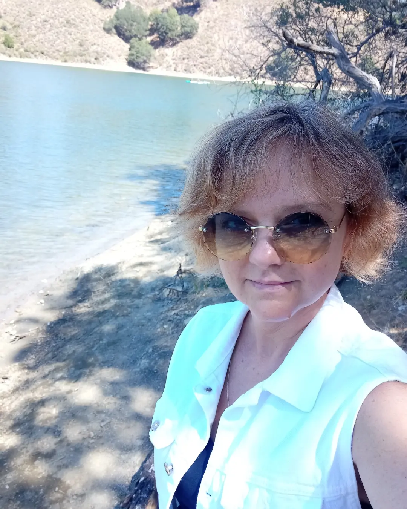

# **Немного обо мне**

***
Меня зовут Людмила Лобанова.
Учусь в Нетологии второй курс.
Я с удовольствием наваяла бы целый сайт, но как всегда дотянула до последнего дня изучаемого блока и теперь просто нет времени ... Но я обещаю что выложу на GitHub Pages все мои курсовые по *Python, SQL и что там было ещё*, как только почуствую себя на этой территории уверенным пользователем.

***

Так я выгляжу:

***

Вы можете написать мне на почту <liudmilanl@mail.ru>
